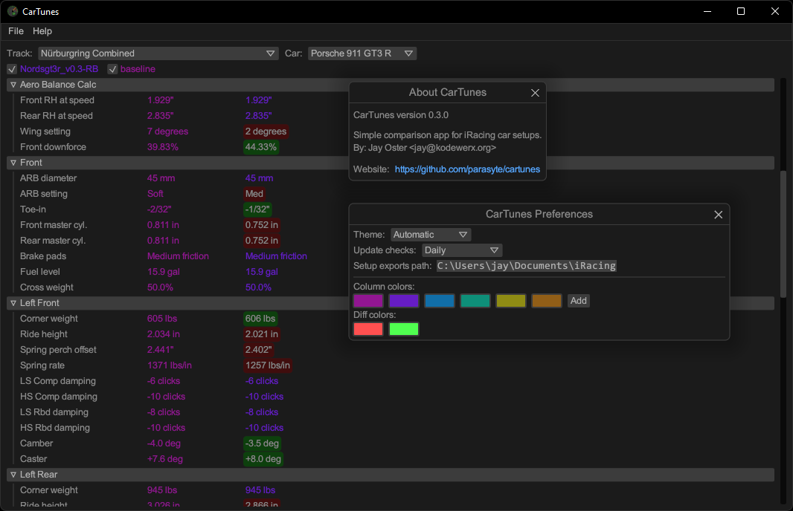
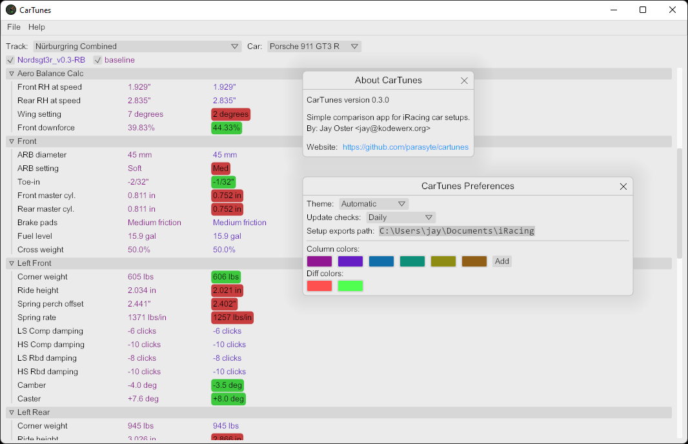

# CarTunes

Simple comparison app for iRacing car setups.

## About

Export a setup in the iRacing garage and CarTunes will let you compare it with other setup exports side-by-side. It will show changes in green or red, depending on whether the value was increased or decreased.

## Configuration

The config file uses [TOML syntax](https://toml.io/en/) which is similar to the INI file format. It can be found in one of the following locations, depending on the host operating system:

| Host OS | Config file path                                                      |
|---------|-----------------------------------------------------------------------|
| Windows | `%AppData%\KodeWerx\CarTunes\config\config.toml`                      |
| macOS   | `$HOME/Library/Application Support/org.KodeWerx.CarTunes/config.toml` |
| Linux   | `$HOME/.config/cartunes/config.toml`                                  |

The [default config file](./src/default.toml) provides default values for most options, and includes basic documentation describing each section.

## Screenshots

